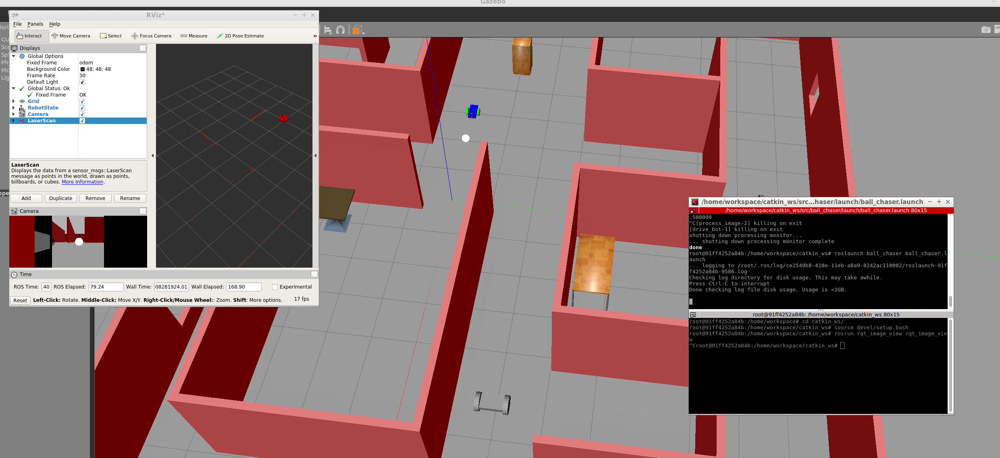
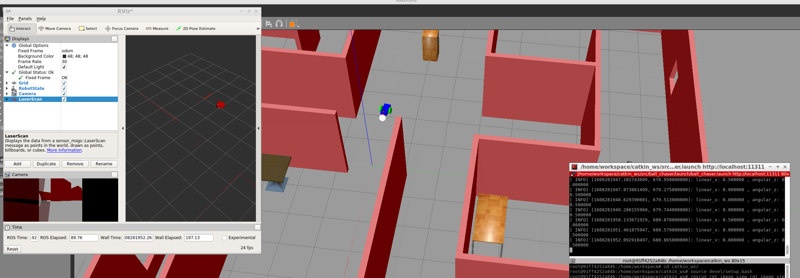
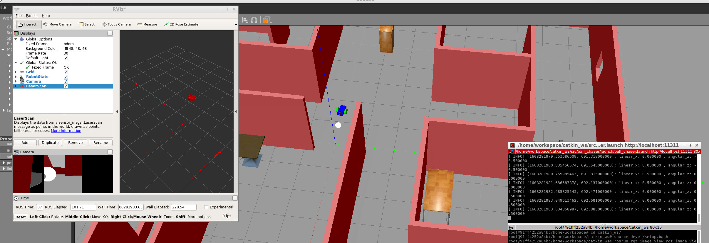

# Go Chase It Project 
Design a robot inside Gazebo, house it in the World &amp;  C++ Nodes in ROS to chase white balls. Solution for Udacity Robotics Software Engineer Nanodegree Program





# Directory Structure
```
    .RoboND-P2-Go_Chase_It             # Go Chase It Project
    ├── my_robot                       # my_robot package                   
    │   ├── launch                     # launch folder for launch files   
    │   │   ├── robot_description.launch
    │   │   └── world.launch
    │   ├── meshes                     # meshes folder for sensors
    │   │   └── hokuyo.dae
    │   ├── urdf                       # urdf folder for xarco files
    │   │   ├── my_robot.gazebo
    │   │   └── my_robot.xacro
    │   ├── worlds                     # world folder for world files
    │   │   ├── myworld.world
    │   │   └── empty.world
    │   ├── CMakeLists.txt             # compiler instructions
    │   └── package.xml                # package info
    ├── ball_chaser                    # ball_chaser package                   
    │   ├── launch                     # launch folder for launch files   
    │   │   └── ball_chaser.launch
    │   ├── src                        # source folder for C++ scripts
    │   │   ├── drive_bot.cpp
    │   │   └── process_images.cpp
    │   ├── srv                        # service folder for ROS services
    │   │   └── DriveToTarget.srv
    │   ├── CMakeLists.txt             # compiler instructions
    │   └── package.xml                # package info                  
    └── Results                        # result images of robot running         
        ├── 1.PNG                     
        ├── 2.PNG                     
        └── 3.PNG                     
```


## Create the  `my_robot`  Package

**Create and initialize a  `catkin_ws`**
Feel free to skip if you already have a  `catkin_ws`.

```
$ mkdir -p /home/workspace/catkin_ws/src
$ cd /home/workspace/catkin_ws/src
$ catkin_init_workspace
```
#### Clone or Download This Project Under the `/home/workspace/catkin_ws`
```
$ cd /home/workspace/catkin_ws
$ rm -rf src
$ git clone https://github.com/studian/RoboND-P2-Go_Chase_It.git src
```

## Build Package

Compile it with:

```
$ cd /home/workspace/catkin_ws/
$ catkin_make
```

## Test  `process_image `

To test if the code you just wrote is working as expected, first launch the robot inside your world and then run both the  `drive_bot`  and  `process_image`  nodes.

**1- Launch the robot inside your world**

This can be done by launching the  `world.launch`  file:

```
$ cd /home/workspace/catkin_ws/
$ source devel/setup.bash
$ roslaunch my_robot world.launch
```

**2- Run   `drive_bot`  and  `process_image` (new terminal)**

This can be done by executing  `ball_chaser.launch`:

```
$ cd /home/workspace/catkin_ws/
$ source devel/setup.bash
$ roslaunch ball_chaser ball_chaser.launch
```
